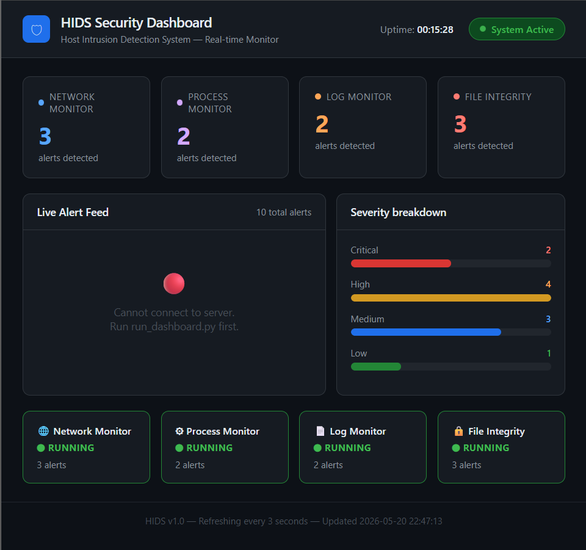

# Host-Based IDS

A Host-Based Intrusion Detection System (HIDS) developed to monitor system activities, analyze logs, and detect suspicious behavior in real time.

## Features

* Real-time log monitoring
* Suspicious activity detection
* Interactive dashboard
* User-friendly interface

## Technologies Used

* HTML
* CSS
* JavaScript
* Python

## Dashboard Preview

